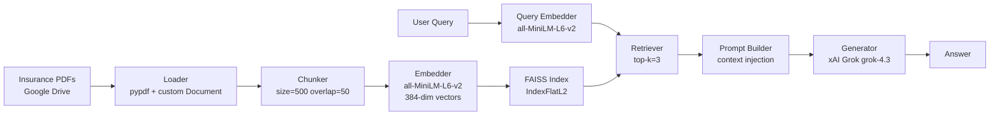

# RAG From Scratch

> A retrieval-augmented generation pipeline built without frameworks —
> PDF loading, character-based chunking, sentence-transformer embeddings,
> FAISS vector search, and closed-book generation via xAI Grok.
> Built to understand what LangChain abstracts before ever touching it.

## Architecture



## Why No Frameworks?

LangChain and LlamaIndex are useful — but they hide what's actually happening.
Building from scratch first means:

- I know that a "retriever" is an embedding function + a nearest-neighbour
  search over a vector index — nothing more
- I know that a "document loader" is a file parser that returns structured
  objects with metadata
- I know that "generation" is prompt construction + an LLM API call
- I know exactly what breaks when something goes wrong in production

When a framework abstracts something, I know what it's hiding —
because I wrote it myself first.

## Stack

| Stage | Implementation |
|---|---|
| Document loading | `pypdf` + custom `Document` dataclass |
| Chunking | Character-based, size=500, overlap=50 |
| Embedding | `sentence-transformers` — `all-MiniLM-L6-v2` (384-dim) |
| Vector store | FAISS `IndexFlatL2` |
| Retrieval | Top-k nearest neighbour (k=3) |
| Generation | xAI Grok (`grok-4.3`) via `xai-sdk` |
| Corpus | BFL insurance policy PDFs |

## How to Run

1. Open `rag_phase3.ipynb` in Google Colab
2. Mount your Google Drive and point `folder_path` at your PDF folder
3. Add your xAI API key to Colab Secrets as `ragAPIkey`
4. Run all cells top to bottom
5. Call `generate_answer("your question here", index, chunks)`

**Dependencies:**
```
pip install sentence-transformers faiss-cpu pypdf xai-sdk
```

## What's Next

This same pipeline rebuilt in LangChain and LlamaIndex, with observability,
cost instrumentation, and structured outputs → [`rag-three-ways`](#) *(coming soon)*
