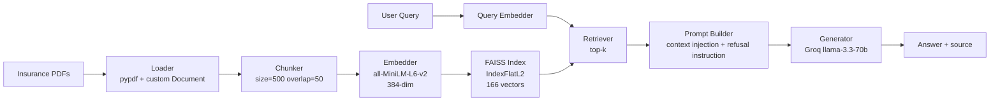

# RAG From Scratch

> A retrieval-augmented generation pipeline built without frameworks — PDF loading,
> character-based chunking, sentence-transformer embeddings, FAISS vector search, and
> context-grounded generation. Built to understand what LangChain abstracts before
> ever touching it.

Corpus: four commercial insurance and risk-management PDFs (Alberta higher-education
sector), 166 chunks indexed.

## Architecture



## Why No Frameworks?

LangChain and LlamaIndex are useful — but they hide what's actually happening.
Building from scratch first means:

- I know that a "retriever" is an embedding function plus a nearest-neighbour search
  over a vector index — nothing more
- I know that a "document loader" is a file parser returning structured objects with
  metadata
- I know that "generation" is prompt construction plus an API call
- I know what to look at first when retrieval quality degrades in production

## Stack

| Stage | Implementation |
|---|---|
| Document loading | `pypdf` + custom `Document` dataclass, `.txt` and `.pdf` handling |
| Chunking | Character-based, size=500, overlap=50 → 166 chunks from 4 documents |
| Embedding | `sentence-transformers` — `all-MiniLM-L6-v2` (384-dim) |
| Vector store | FAISS `IndexFlatL2` |
| Retrieval | Top-k nearest neighbour, L2 distance returned in chunk metadata |
| Generation | Groq `llama-3.3-70b-versatile` |
| Also tested | xAI `grok-4.3` (`xai-sdk`), Google `gemini-2.0-flash` |

## Design Notes

**The prompt does the grounding work.** The generator is instructed to answer using only
the supplied context and to reply *"I don't have enough information to answer that"*
otherwise. Retrieved chunks are injected with their source filename so answers can be
attributed.

**k matters more than expected.** At k=3 the retriever missed answers that span multiple
source documents. k=6 retrieved them. This is a retrieval-recall problem, not a
generation problem — which is the argument for building a proper evaluation harness
rather than eyeballing outputs.

**L2 distance is kept in metadata.** `retrieve()` writes the FAISS distance onto each
returned chunk, so retrieval quality is inspectable rather than hidden behind an
abstraction.

## Verified Behaviour

Query: *"what is covered for water damage?"*

The pipeline retrieves the relevant chunk and answers with the correct policy figures
and source attribution:

```
For water damage, there is a 5% minimum $50,000 subject to maximum $150,000 coverage.
Source: AB Colleges 2025 Symposium - Edmonton October 2025 - Presentation.pdf
```

Retrieval and generation outputs are preserved in the notebook.

## Not Yet Done

This repo demonstrates a working pipeline. It does **not** yet include measured retrieval
quality — no golden set, no precision/recall baseline, no reranking. That work is in
[`rag-eval-harness`](https://github.com/Victorianukiry/rag-eval-harness) and is in
progress. Nothing here should be read as an evaluated system.

## How to Run

1. Open `rag_from_scratch.ipynb` in Google Colab
2. Mount Google Drive and point `folder_path` at a folder of PDFs
3. Add your Groq API key to Colab Secrets as `grokapi`
4. Run all cells top to bottom
5. Call `generate_answer("your question here", index, chunks, k=6)`

```bash
pip install sentence-transformers faiss-cpu pypdf groq
```

## Related

| Repo | What it covers |
|---|---|
| `rag-from-scratch` (this repo) | The pipeline with no framework |
| [`rag-three-ways`](https://github.com/Victorianukiry/rag-three-ways) | The same pipeline in LangChain, with structured outputs and tracing |
| [`rag-eval-harness`](https://github.com/Victorianukiry/rag-eval-harness) | Retrieval metrics implemented from first principles |
